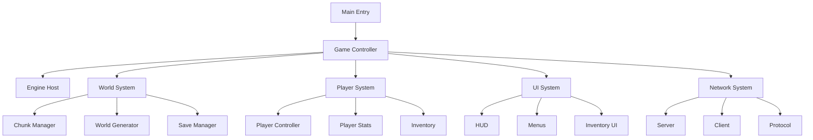
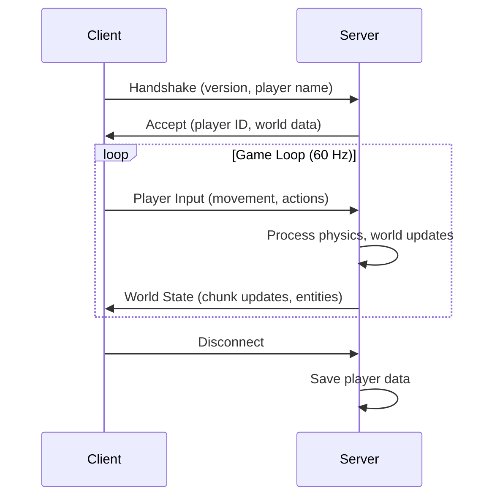

# TesselBox Architecture

System architecture, design patterns, and data flow documentation.

## Overview

TesselBox is a 3D hexagonal voxel game built on the Kaiju Engine. The architecture follows a modular, component-based design with clear separation of concerns.



## Core Systems

### Game State Machine

The game uses a hierarchical state machine with the following states:

```
Login → MainMenu → WorldSelect → Loading → Playing
                    ↓
                Multiplayer → Loading → Playing
                                    ↓
                                Paused/Inventory/Crafting/Settings
```

**Key Features:**
- Validated state transitions
- Callbacks for state change events
- Automatic UI updates on transitions

### Entity-Component System

Built on Kaiju Engine's ECS:

```go
// Entity represents a game object
type Entity struct {
    ID        EntityID
    Transform Transform
    Components map[ComponentType]Component
    Active    bool
}
```

**Components:**
- `TransformComponent` - Position, rotation, scale
- `RenderComponent` - Mesh, material, drawing
- `PhysicsComponent` - Collider, rigidbody
- `LogicComponent` - Custom game logic

## World System

### Chunk Architecture

The world is divided into chunks for efficient management:

```
World (infinite)
  └── ChunkManager
        └── Chunks (16x16 blocks, loaded on-demand)
              └── Blocks (11+ types)
```

**Chunk Lifecycle:**
1. Player moves near chunk coordinates
2. ChunkManager checks if chunk exists
3. If not: Generate or load from disk
4. Create mesh for rendering
5. Add to render list
6. When player moves away: Unload (save if modified)

### Hexagonal Coordinate System

TesselBox uses axial coordinates for hexagonal grids:

```go
// Axial coordinates
type HexCoord struct {
    Q, R int  // Q + R + S = 0, so S is implicit
}

// World position conversion
func (h HexCoord) ToWorld(scale float32) Vec3 {
    x := scale * (sqrt(3)*float32(h.Q) + sqrt(3)/2*float32(h.R))
    z := scale * (3.0/2.0 * float32(h.R))
    return Vec3{x, 0, z}
}
```

**Coordinate Conversions:**
- `HexCoord` → `World Position`: For rendering
- `World Position` → `BlockPos`: For block lookup
- `BlockPos` → `ChunkCoord`: For chunk management

### World Generation

Procedural generation pipeline:

1. **Terrain Height**: Perlin noise with multiple octaves
2. **Biome Selection**: Voronoi cells + temperature/moisture maps
3. **Surface Blocks**: Based on biome (grass, sand, snow)
4. **Ore Distribution**: Random with depth-based rarity
5. **Structure Generation**: Trees, caves, dungeons

```
Seed → Height Map → Biome Map → Surface → Features → Final Chunk
```

## Rendering System

### Hexagonal Prism Meshes

Each block type generates a mesh with:
- 24 vertices (4 per face × 6 faces)
- 36 indices (2 triangles per face × 6 faces)
- Per-face normals for lighting
- UV coordinates for texturing

**Face Layout:**
```
       Top (0)
        /\
   ____/  \____
  /  1 \ 2 / 3  \
 /______\/______\
 \  4   /\  5   /
  \____/ 6 \___/
       \/
    Bottom (7)
```

### Rendering Pipeline

```
Game Loop:
  1. Update world (generate chunks, update blocks)
  2. Update player (movement, camera)
  3. Update physics (collisions, entities)
  4. Cull chunks outside view frustum
  5. Submit visible chunks to renderer
  6. Render (Vulkan)
```

**Optimization Techniques:**
- Frustum culling by chunk
- Occlusion culling for hidden faces
- LOD for distant chunks (simplified meshes)
- Instanced rendering for same block types

## Player System

### Player Controller

First-person movement system:

```go
type PlayerController struct {
    Position    Vec3
    Velocity    Vec3
    Rotation    Vec2  // Yaw, Pitch
    OnGround    bool
    
    // Movement settings
    WalkSpeed   float32
    SprintSpeed float32
    JumpForce   float32
    
    // Collision
    Hitbox      AABB
}
```

**Movement Physics:**
1. Process input (WASD, mouse)
2. Calculate desired velocity
3. Check collision with world
4. Resolve collisions
5. Apply gravity
6. Update position

### Camera Control

First-person camera attached to player:

```
Camera Position = Player Position + Eye Offset
Camera Rotation = Player Yaw/Pitch
FOV = 70° (adjustable)
Near/Far = 0.1 / 1000
```

**Mouse Look:**
- Yaw: 0-360 degrees (horizontal rotation)
- Pitch: -90 to +90 degrees (vertical, clamped)
- Sensitivity: Configurable (default 0.1)

### Interaction System

Ray casting for block interaction:

```
1. Cast ray from camera center
2. Step through blocks along ray
3. Find first solid block within reach (4 blocks)
4. For break: target block
5. For place: adjacent empty space
```

## Networking

### Client-Server Architecture



### Protocol

Message types:
- `Handshake` - Connection establishment
- `PlayerUpdate` - Position, rotation, actions
- `BlockUpdate` - Block place/break
- `ChunkData` - Chunk load/update
- `EntityUpdate` - Mob/player entity state
- `Chat` - Text messages

**Serialization:**
- Binary protocol for efficiency
- Delta compression for updates
- Priority queuing (critical state first)

### Prediction & Reconciliation

Client-side prediction for smooth gameplay:

```
Client Action:
  1. Predict result locally (immediate feedback)
  2. Send to server
  3. Receive server confirmation
  4. If mismatch: Reconcile (correct position)
  5. Replay predicted inputs from correction point
```

## UI System

### Component Hierarchy

```
UIManager
  └── Panel (root)
        ├── HUD
        │     ├── Status Bars
        │     ├── Hotbar
        │     ├── Crosshair
        │     └── Debug Info
        ├── Menus
        │     ├── Main Menu
        │     ├── Pause Menu
        │     ├── Settings
        │     ├── World Select
        │     └── Inventory
        └── Overlays
              ├── Chat
              └── Notifications
```

### Event System

UI events flow through the engine:

```
Input (Mouse/Keyboard)
  ↓
Engine Event System
  ↓
UI Manager (hit testing)
  ↓
Component Event Handler
  ↓
Game Logic
  ↓
UI Update
```

**Event Types:**
- `Click` - Mouse button down/up
- `Hover` - Mouse enter/leave
- `Focus` - Input focus change
- `ValueChange` - Slider, input changes

### HTML/CSS Integration

Kaiju Engine supports HTML/CSS-based UI:

```html
<!-- ui/main_menu.html -->
<div id="mainMenu">
  <button id="btnSinglePlayer">Single Player</button>
  <button id="btnMultiplayer">Multiplayer</button>
</div>
```

```go
// Load and display
html := host.AssetDatabase().ReadText("ui/main_menu.html")
doc := markup.DocumentFromHTMLString(&uiManager, html, "", nil, nil, nil)

// Handle events
btn := doc.GetElementById("btnSinglePlayer")
btn.UI.ToButton().Base().AddEvent(ui.EventTypeClick, onSinglePlayer)
```

## Save System

### Data Model

```
Save/
  ├── world.json          # World metadata (seed, name, time)
  ├── player.json         # Player state (position, inventory, stats)
  └── chunks/
        ├── 0_0.chunk     # Chunk data (RLE compressed)
        ├── 0_1.chunk
        └── ...
```

### Serialization

Chunk compression using RLE (Run-Length Encoding):

```go
// Encode: [blockID, count] pairs
// [1, 5, 2, 3, 1, 8] = 5 stone, 3 dirt, 8 stone

func EncodeChunk(chunk *Chunk) []byte {
    var result []byte
    currentID := chunk.Blocks[0]
    count := uint8(1)
    
    for i := 1; i < len(chunk.Blocks); i++ {
        if chunk.Blocks[i] == currentID && count < 255 {
            count++
        } else {
            result = append(result, byte(currentID), count)
            currentID = chunk.Blocks[i]
            count = 1
        }
    }
    return result
}
```

### Auto-Save

- Periodic saves every 5 minutes
- Save on world exit
- Incremental saves (only modified chunks)
- Background thread for non-blocking I/O

## Performance Considerations

### Memory Management

**Object Pooling:**
- Chunks: Pool of 64×64×64 blocks
- Block meshes: Reuse mesh data
- Particle effects: Pre-allocated arrays

**Streaming:**
- Load chunks in background threads
- Unload distant chunks (keep in disk cache)
- Texture streaming for large worlds

### CPU Optimization

**Update Culling:**
- Only update chunks near player
- Batch block updates
- Multithreaded chunk generation

**Physics:**
- Spatial hash for entity queries
- Simplified physics for distant entities
- Sleep inactive entities

### GPU Optimization

**Draw Call Batching:**
- Combine same-material blocks
- Instanced rendering for repeated meshes
- Frustum + occlusion culling

**Texture Atlases:**
- All block textures in single atlas
- Reduces texture binds
- Enables batching

## Extension Points

### Adding New Block Types

1. Define block in `pkg/blocks/registry.go`
2. Add texture to atlas
3. Register crafting recipes if applicable

### Adding New Items

1. Create item in `pkg/crafting/items.go`
2. Define properties (stack size, tool type)
3. Add to item registry
4. Create recipes

### Adding New World Features

1. Extend `pkg/world/generator.go`
2. Add generation step to pipeline
3. Update chunk serialization if needed

## Threading Model

```
Main Thread:
  - Input handling
  - Game logic updates
  - UI updates
  - Rendering submission

Worker Threads (4):
  - Chunk generation
  - Mesh building
  - Save I/O
  - Network processing
```

**Synchronization:**
- Read-write locks for chunk data
- Message queues for thread communication
- Double buffering for mesh data
